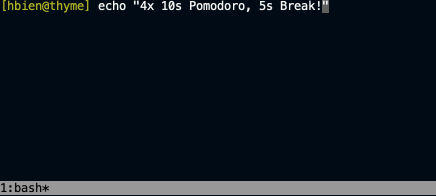

# Thyme

Thyme is a pomodoro timer for tmux.



## Installation

Download the binary here:

* [thyme v0.1.0](https://github.com/hughbien/thyme/releases/tag/v0.1.0)

and place it in your `$PATH`. Or checkout this repo and run `make build`, the binary should be
located at `target/thyme`.


## Usage

Start thyme with:

```
thyme
```

You'll have 25 minutes by default. Other useful commands:

```
thyme       # run again to pause/unpause
thyme -s    # to stop
thyme -r    # repeats timer until manually stopped; default break of 5 minutes
thyme -r10  # repeat timer 10 times
thyme -f    # run in foreground, useful for debugging hooks
```

## Configuration

Configure via the `~/.thymerc` file:

```toml
timer = 1500               # 25 minutes per pomodoro (in seconds)
timer_break = 300          # 5 minutes per break (in seconds)
timer_warning = 300        # show warning color at 5 minutes left (in seconds)
repeat = 4                 # set default for -r flag, otherwise repeat indefinitely
color_default = "default"  # set default timer color for tmux
color_warning = "red"      # set warning color for tmux, set to "default" to disable
color_break = "default"    # set break color for tmux
status_align = "left"      # use tmux's left status line instead, defaults to "right"
```

Thyme sets tmux's status-right/left and interval for you. If you'd prefer to do this yourself (or
need to combine it with other statuses), set `status_override`:

```toml
status_override = false    # don't let thyme set tmux's status-right/left/interval
```

Then in your `~/.tmux.conf` file, set the status command and interval:

```
set -g status-right '#(cat /path/to/thyme-status)'
set -g status-interval 1
```

Custom options can be added via the `[options.*]` group. The today example below adds a `-t` option
for opening a todo today file. The hello example echos to STDOUT.

```toml
[options.today]
flag = "-t"
flag_long = "--today"
description = "Open TODO today file"
command = "vim ~/path/to/todo.md"

[options.hello]
flag = "-H"
flag_long = "--hello name"
description = "Say hello!"
command = "echo \"Hello #{flag}! #{args}.\"" # eg `thyme -H John "How are you?"`
```

The following placeholders are available for options:

* `#{flag}` - the argument passed to your flag
* `#{args}` - any additional arguments passed to the thyme binary

Custom hooks can be added via the `[hooks.*]` group. Valid events are: `before`/`after` a pomodoro,
`before_break`/`after_break` for breaks, and `before_all`/`after_all` for the entire session.

```toml
[hooks.notify]
events = ["after"]
command = "terminal-notifier -message \"Pomodoro finished #{repeat_suffix}\" -title \"thyme\""

[hooks.notify_break]
events = ["after_break"]
command = "terminal-notifier -message \"Break finished #{repeat_suffix}\" -title \"thyme\""
```

The following placeholders are available for hooks:

* `#{repeat_index}` - current repeat index
* `#{repeat_total}` - total repeat count for this session
* `#{repeat_suffix}` - if repeating is on, will return `(index/total)` eg `(3/5)`. Otherwise empty string.

## Development

Use `make` for common tasks:

```
make spec                    # to run all tests
make spec ARGS=path/to/spec  # to run a single test
make build                   # to create a release binary in the target directory
make install                 # to copy release binary into system bin (uses $INSTALL_BIN)
make clean                   # to remove build artifacts and target directory
make reset                   # to reload ~/.tmux.conf file (useful while debugging)
make run                     # to run locally
make run ARGS=-h             # to run with local arguments
```

## License

Copyright 2020 Hugh Bien.

Released under BSD License, see LICENSE for details.
